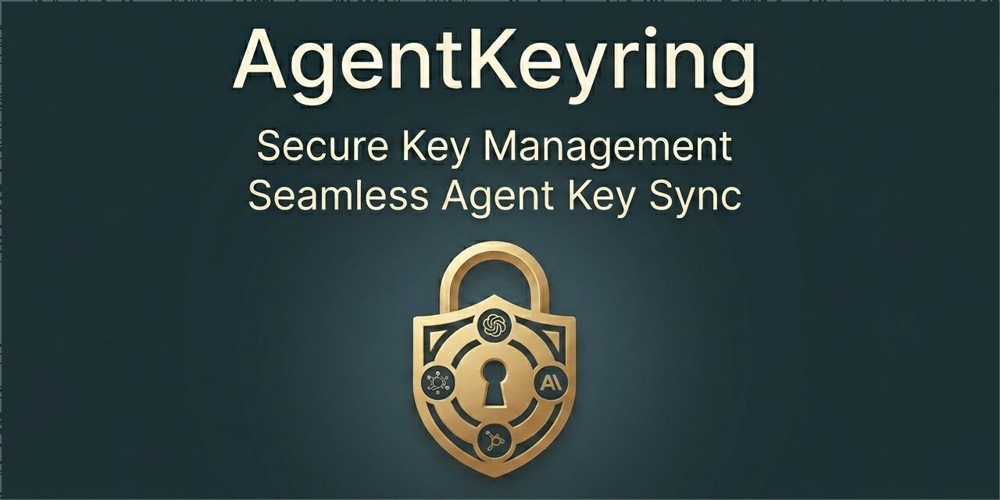

  

<h1 align="center">AgentKeyring</h1>

  Manage LLM API keys once, validate them, and sync them into your local AI tools safely.

  Open-source, local-first desktop app for reducing setup friction across AI agents,
  coding assistants, and other local AI clients.

  
  
  
  
  

  

AgentKeyring is an open-source, local-first desktop app for reducing the setup friction around AI agents, coding assistants, and other local AI clients.

## The Problem

Using AI tools locally often means repeating the same setup work:

- copying API keys into different tools
- figuring out where config files live
- switching between providers and models
- editing `.env`, JSON, or YAML by hand
- debugging why a tool still does not work

For many users, this setup friction is much harder than it should be.

## What AgentKeyring Does

AgentKeyring helps you:

- manage multiple LLM provider API keys in one place
- validate whether a key actually works
- inspect available models for supported providers
- detect supported AI agents and clients installed on your machine
- preview and sync configuration into those tools
- back up config before writing anything
- reduce repeated edits to env vars and config files

## How It Works

1. Add your OpenAI, Anthropic, or other provider keys once.
2. Verify that the keys are valid.
3. Detect which supported local tools are installed.
4. Preview what configuration changes would be made.
5. Back up current config before writing anything.
6. Sync supported settings into the target tool.

## Why It Feels Different

AgentKeyring is designed around a few practical principles:

- local-first by default
- transparent about what changes were made
- backup before config write
- simple enough for non-developers
- open source from the beginning

## Planned MVP

The first version is focused on:

- multi-provider API key management
- key validation
- model capability detection
- installed tool discovery
- connector-based config sync
- backup before config write
- clear success and failure feedback

## What It Is Not

AgentKeyring is **not**:

- a chat client
- a hosted LLM platform
- a proxy gateway
- a replacement for your existing AI tools

It is a **local-first configuration and credential management tool**.

## Early Target Integrations

The first release should stay focused on a small number of useful targets instead of trying to support everything at once.

Planned categories include:

- agent CLI tools
- coding assistants
- editor and note-taking integrations
- common config export targets

The long-term goal is to support more tools through a clear connector model, but the initial release should stay narrow and reliable.

## Project Status

AgentKeyring is currently in early build mode.

Current priorities:

1. define and tighten the MVP
2. choose the first supported integrations
3. validate setup pain points with real users
4. ship a working local-first desktop prototype

## Architecture

AgentKeyring is built as a `Tauri 2` desktop app with:

- a Rust backend for secret handling, filesystem operations, detection, backup, and sync orchestration
- a React + TypeScript frontend for UI, workflows, previews, and results
- connector and provider extension points for future open-source contributions

See the project docs for more detail:

- [Architecture](./docs/architecture.md)
- [Connector SDK](./docs/connector-sdk.md)
- [Provider Adapter](./docs/provider-adapter.md)

## Contributing

Feedback, issues, and early discussion are welcome. See [CONTRIBUTING.md](CONTRIBUTING.md) for details.

At this stage, the most useful contributions are:

- sharing setup pain points
- suggesting high-value integrations
- reporting confusing configuration workflows
- proposing or implementing provider adapters
- proposing or implementing tool connectors

## License

Licensed under the [Apache License 2.0](LICENSE).
