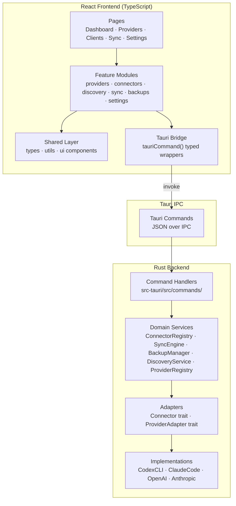
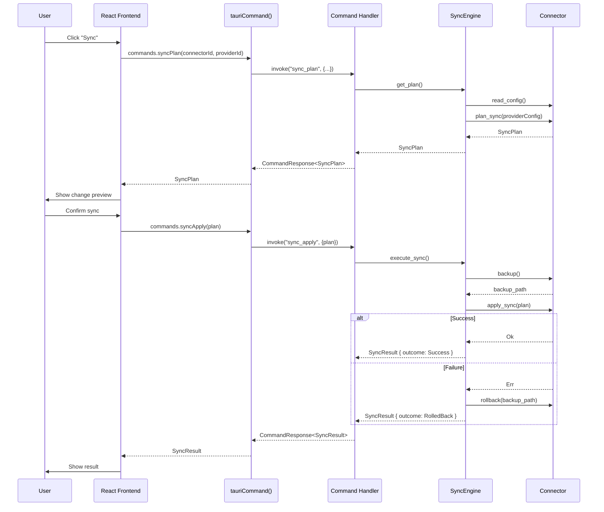

# AgentKeyring Architecture

AgentKeyring is a Tauri 2 desktop application (Rust backend + React/TypeScript frontend) that manages LLM API keys and syncs them to local AI tools. This document describes the overall architecture, module responsibilities, frontend/backend boundaries, and data flow.

## Layered Architecture



## Layer Responsibilities

| Layer | Location | Responsibility |
|-------|----------|----------------|
| Pages | `src/pages/` | Top-level route components. Compose feature hooks and shared UI. |
| Feature Modules | `src/features/{domain}/` | Domain-specific hooks, services, and components. Each module exposes a public API via `index.ts`. |
| Shared Layer | `src/shared/` | Cross-module TypeScript types (`types/`), utility functions (`utils/`), and reusable UI components (`ui/`). |
| Tauri Bridge | `src/shared/utils/tauriCommand.ts` | Type-safe `invoke()` wrappers. All frontend→backend calls go through `commands.*` functions. |
| Command Handlers | `src-tauri/src/commands/` | `#[tauri::command]` functions. Thin layer that delegates to domain services and wraps results in `CommandResponse<T>`. |
| Domain Services | `src-tauri/src/services/` | Core business logic — sync orchestration, backup management, connector registry, discovery scanning, provider registry. |
| Adapters (traits) | `src-tauri/src/adapters/` | `Connector` and `ProviderAdapter` trait definitions — the extension points for adding new tools and LLM providers. |
| Adapter Impls | `src-tauri/src/adapters/connectors/`, `providers/` | Concrete implementations (Codex CLI, Claude Code, OpenAI, Anthropic). |
| Types | `src-tauri/src/types/` | Shared Rust structs with `Serialize`/`Deserialize`. Mirror the TypeScript types in `src/shared/types/`. |

## Frontend / Backend Boundary

The boundary is enforced by Tauri's IPC mechanism. The frontend never touches the filesystem or secrets directly.

**Rust backend owns:**
- API key storage and validation (keys never leave the Rust process)
- Filesystem reads/writes (config files, backups)
- Tool detection (`detect()` calls)
- Sync orchestration (backup → apply → rollback)

**React frontend owns:**
- UI rendering and user interaction
- Application state (via React hooks)
- Calling Tauri Commands through typed wrappers
- Displaying sync previews, progress, and results

All communication uses `CommandResponse<T>`:

```rust
pub struct CommandResponse<T> {
    pub success: bool,
    pub data: Option<T>,
    pub error: Option<ErrorInfo>,  // { code, message }
}
```

The TypeScript side unwraps this via `tauriCommand<T>()`, which throws `TauriCommandError` on failure.

## Tauri Command Manifest

| Command | Parameters | Returns | Purpose |
|---------|-----------|---------|---------|
| `provider_validate_key` | `provider_id`, `api_key` | `KeyValidationResult` | Validate an API key |
| `provider_list_models` | `provider_id` | `Vec<ModelInfo>` | List available models |
| `provider_save` | `config: ProviderConfig` | `()` | Save provider config |
| `provider_list` | — | `Vec<ProviderConfig>` | List all providers |
| `provider_delete` | `provider_id` | `()` | Delete a provider |
| `connector_list` | — | `Vec<ConnectorMeta>` | List registered connectors |
| `connector_detect` | `connector_id` | `DetectResult` | Detect a single connector |
| `discovery_scan` | — | `Vec<DiscoveryResult>` | Scan all connectors |
| `sync_plan` | `connector_id`, `provider_id` | `SyncPlan` | Preview sync changes |
| `sync_apply` | `plan: SyncPlan` | `SyncResult` | Execute sync (with auto-backup) |
| `sync_rollback` | `connector_id`, `backup_path` | `()` | Rollback to backup |
| `sync_history` | `limit?` | `Vec<SyncRecord>` | Query sync history |
| `backup_list` | `connector_id?` | `Vec<BackupRecord>` | List backup records |

## Data Flow: Sync Operation



## Feature Module Structure

Each feature module follows the same internal layout:

```
src/features/{domain}/
├── index.ts          # Public API exports (with JSDoc)
├── components/       # Domain-specific React components
├── hooks/            # React hooks (data fetching, state)
├── services/         # Service functions calling tauriCommand
└── types/            # Domain-specific TypeScript types (if needed)
```

Modules interact only through their `index.ts` exports. Adding a new feature module requires no changes to existing modules.

## Rust Backend Structure

```
src-tauri/src/
├── main.rs                        # Tauri builder, service init, command registration
├── types/                         # Shared structs (Serialize/Deserialize)
│   ├── provider.rs                # ProviderMeta, ProviderConfig, KeyValidationResult, ...
│   ├── connector.rs               # ConnectorMeta, DetectResult, SyncPlan, ConnectorResult<T>, ...
│   ├── sync.rs                    # SyncRecord, SyncOutcome, SyncResult
│   ├── backup.rs                  # BackupRecord
│   └── command.rs                 # CommandResponse<T>
├── adapters/
│   ├── connector_trait.rs         # Connector trait (extension point)
│   ├── provider_trait.rs          # ProviderAdapter trait (extension point)
│   ├── connectors/                # Concrete Connector implementations
│   │   ├── codex_cli.rs
│   │   └── claude_code.rs
│   └── providers/                 # Concrete Provider implementations
│       ├── openai.rs
│       └── anthropic.rs
├── services/
│   ├── connector_registry.rs      # ConnectorRegistry (register, list, get)
│   ├── discovery_service.rs       # DiscoveryService (scan_all with 5s timeout)
│   ├── sync_engine.rs             # SyncEngine (full sync flow + concurrency lock)
│   ├── backup_manager.rs          # BackupManager (create, restore, list)
│   └── provider_registry.rs       # ProviderRegistry
└── commands/
    ├── provider_commands.rs       # provider_* commands
    ├── connector_commands.rs      # connector_*, discovery_scan commands
    ├── sync_commands.rs           # sync_* commands
    └── backup_commands.rs         # backup_list command
```

## Error Handling

Errors flow from Rust adapters/services through command handlers to the frontend:

```
Adapter/Service → ConnectorResult::Err { code, message }
    → Command Handler → CommandResponse { success: false, error: { code, message } }
        → tauriCommand() → throws TauriCommandError(code, message)
            → Feature Hook → error state → UI component
```

Error code prefixes by domain:

| Prefix | Domain | Examples |
|--------|--------|----------|
| `PROVIDER_` | Provider operations | `PROVIDER_INVALID_KEY`, `PROVIDER_NETWORK_ERROR` |
| `CONNECTOR_` | Connector operations | `CONNECTOR_DETECT_FAILED`, `CONNECTOR_CONFIG_READ_ERROR` |
| `SYNC_` | Sync engine | `SYNC_BACKUP_FAILED`, `SYNC_APPLY_FAILED`, `SYNC_CONCURRENT` |
| `SYSTEM_` | System-level | `SYSTEM_FS_PERMISSION` |
| `TIMEOUT_` | Timeouts | `TIMEOUT_DETECT` |
